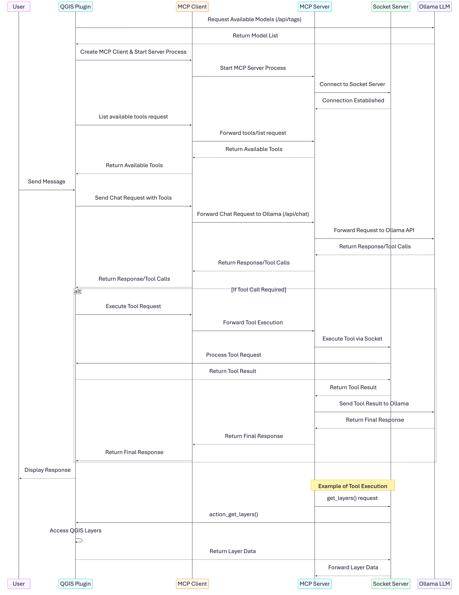

# Smart-QGIS

Smart-QGIS is a QGIS plugin that runs an MCP server and interfaces with local LLMs to enable intelligent, chat-driven geospatial data processing and mapping.

## Installation

- Install QGIS as a prerequisite.
- Install uv to enable the MCP server to run within QGIS.
- Copy the plugin’s source code into the QGIS plugin directory.

  - Windows: `%APPDATA%\QGIS\QGIS3\profiles\default\python\plugins\`
  - macOS: `~/Library/Application Support/QGIS/QGIS3/profiles/default/python/plugins`
  - Linux: `~/.local/share/QGIS/QGIS3/profiles/default/python/plugins/`

## Main components

## Thanks

This project is strongly inspired by [QGISMCP](https://github.com/jjsantos01/qgis_mcp) project.
